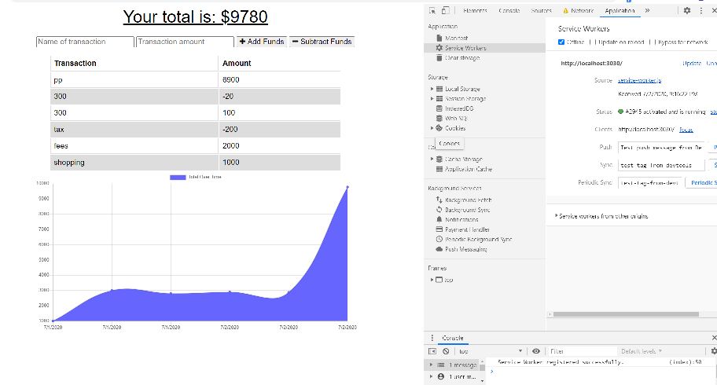

# Unit 18 PWA Homework: Online/Offline Budget Trackers

## Description

Add functionality to our existing Budget Tracker application to allow for offline access and functionality.

The user will be able to add expenses and deposits to their budget with or without a connection. When entering transactions offline, they should populate the total when brought back online.

Offline Functionality:

  * Enter deposits offline

  * Enter expenses offline
____

##  Applications Uses in this projects
    * Node.js
    * Mngoose
    * Express
    * Webpack
    * Babel

## Instalation 

        $ npm install,
        $ npm install express,
        $ npm install gitignore,
        $ npm install mongoose,
        $ npm install --save-dev webpack-cli,
        $ npm install --save-dev webpack,
        $ npm install --save-dev webpack-pwa-manifest,
        $ npm install -D babel-loader @babel/core @babel/preset-env webpack,

## plugins:
WebpackPwaManife

  ### Instalation
  npm install --save-dev webpack-pwa-manifest
  <br/>
`const WebpackPwaManifest = require("webpack-pwa-manifest");`

## Pages  view


# Links to Project

#### GitHub
 [GitHub repository](https://rumardas.github.io/budget_Trackers/.)

### Run Server

```bash
node server.js
```

